<!-- HEADER: animated banner -->

  

 

<!-- MAIN IDENTITY -->

  
  
  

 

<!-- SYSTEM BLOCK -->

  <samp>
    &gt; initializing system... 
    &gt; loading profile: <b>aldiblloshmi</b> 
    &gt; mode: backend / automation / high-tech ui 
    &gt; source: <a href="https://aoble.net">aoble.net</a> 
    &gt; contact: <a href="mailto:aldi@aoble.net">aldi@aoble.net</a>
  </samp>

---

<!-- TECH GRID -->
<h3 align="center">[ STACK / TOOLING ]</h3>

  

  

---

<!-- CUSTOM STATS PANEL (ANIMATED SVG AS IMAGE) -->
<h3 align="center">[ OPERATION METRICS ]</h3>

  

---

<!-- LOW NOISE DESCRIPTION -->

  
<b>[ EXPAND SYSTEM LOG ]</b>

   
  <samp>
    &gt; focus: backend systems, apis, infra, automation  
    &gt; preference: clean architecture, minimal ui, maximum function  
    &gt; philosophy: build useful things, ship often, keep it sharp  
    &gt; location: /dev/net/aoble  
  </samp>

 

  

